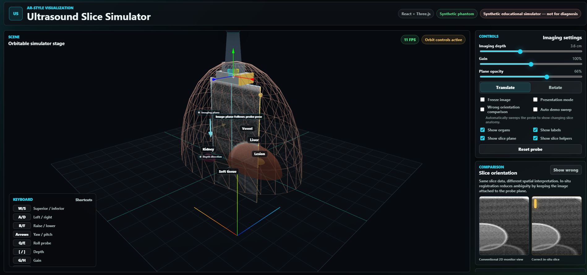
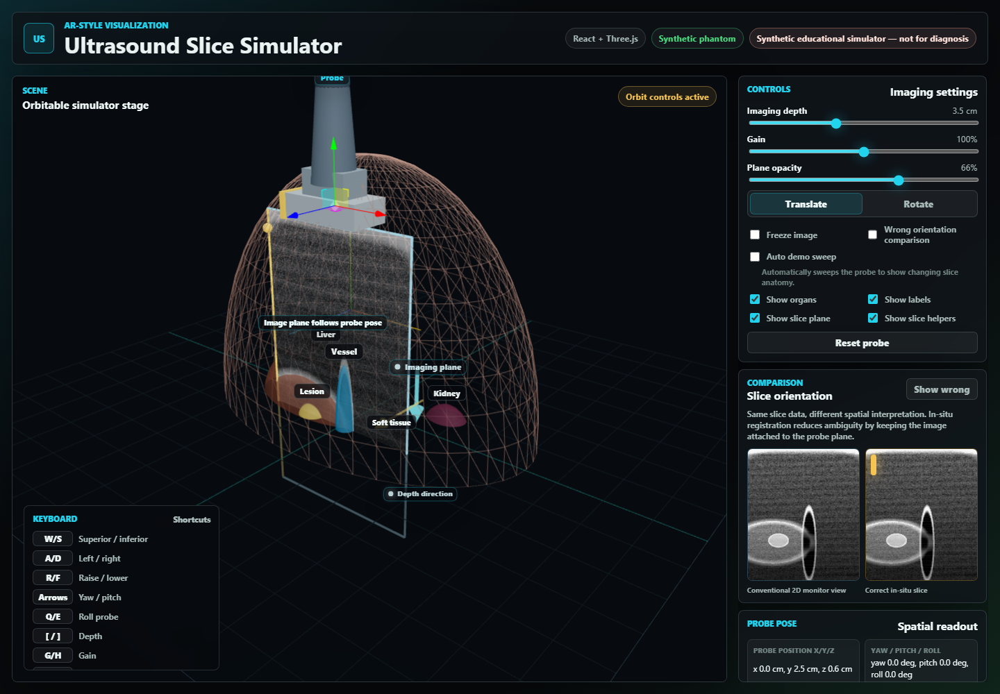
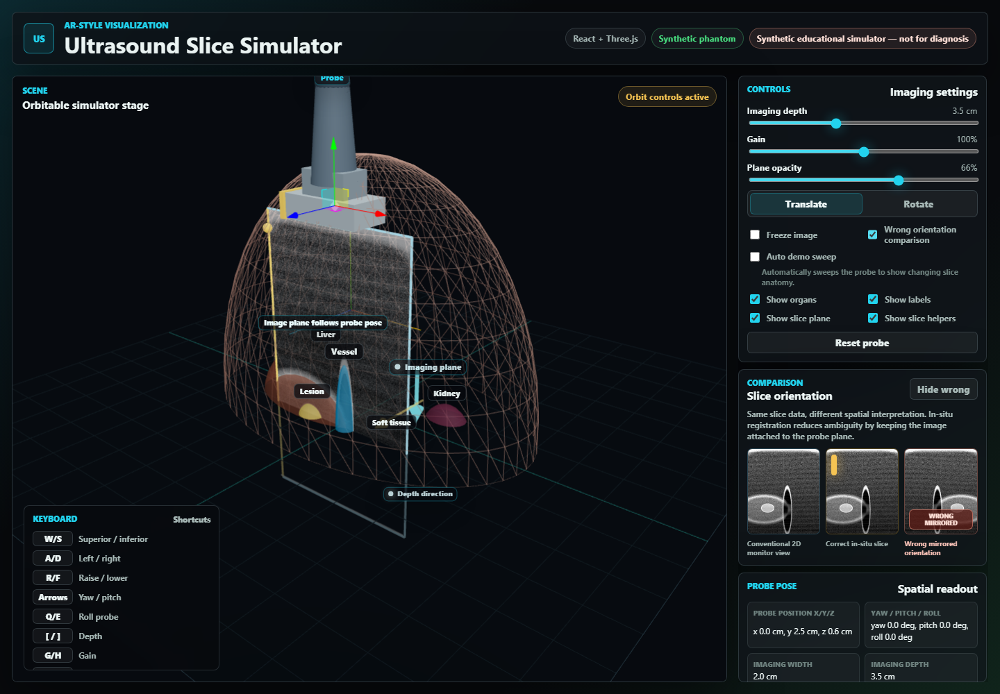

# AR-Style Ultrasound Slice Visualization Simulator


A browser-based React, TypeScript, Vite, and Three.js simulator that attaches a procedurally generated ultrasound slice to a virtual probe moving over a simplified synthetic torso phantom.

## Screenshots







## Why This Project Matters

Conventional ultrasound requires operators to mentally map a detached 2D monitor image back into the 3D anatomy and probe pose that produced it. This prototype demonstrates a spatial-computing alternative: keeping the image registered to the slice plane where it is acquired.

This project demonstrates the core idea behind AR-guided ultrasound visualization: instead of showing a 2D ultrasound image on a detached monitor, the slice is displayed in the 3D location and orientation where it would be acquired. The prototype links virtual probe pose, imaging plane geometry, and generated slice content, making the spatial relationship between anatomy and ultrasound easier to interpret.

## Features

- Interactive 3D torso phantom with translucent synthetic anatomy.
- Virtual ultrasound probe with mouse transform controls and keyboard movement.
- Probe-attached 2D imaging plane that translates and rotates with the probe.
- Procedural B-mode-style ultrasound texture generated from simplified geometry.
- Depth, gain, opacity, labels, organ visibility, freeze, and transform-mode controls.
- Correct in-situ slice comparison against a deliberately wrong mirrored monitor view.
- Auto demo sweep mode for screen recordings and quick portfolio demos.
- Presentation mode and FPS readout for smoother live demonstrations.
- Educational annotations for transducer face, depth direction, imaging plane, and orientation marker.
- Screenshot capture script for README and project-page assets.

## Technical Architecture

- `src/app`: application shell and Zustand simulator state.
- `src/components/scene`: React Three Fiber scene, phantom, probe, slice plane, helpers, and annotations.
- `src/components/ui`: control panels, readouts, comparison monitor, and layout UI.
- `src/domain`: coordinate math, synthetic anatomy data, slice sampling, deterministic noise, and ultrasound rendering.
- `src/hooks`: keyboard controls and auto-sweep animation.
- `src/tests`: Vitest coverage for coordinates, anatomy, slice sampling, and renderer behavior.

The app is static and browser-only. It does not use servers, databases, external 3D models, patient data, or real ultrasound images.

## How The Synthetic Ultrasound Slice Works

The ultrasound texture is procedurally generated from simplified geometry:

1. Each canvas pixel is mapped into probe-local slice coordinates.
2. The local point is transformed into Three.js world space using the probe matrix.
3. The renderer checks whether that world point intersects synthetic ellipsoid organs.
4. Organ definitions provide base intensity, edge intensity, and speckle strength.
5. The renderer adds deterministic speckle noise, boundary brightening, vessel darkening, scanline variation, gain, and depth attenuation.
6. The resulting grayscale image is written to a canvas and used as a `THREE.CanvasTexture` on the in-situ plane.

Because the same organ definitions drive both the 3D phantom and the ultrasound texture, moving the probe across different regions visibly changes the generated slice.

## Controls

- `W/S`: move superior / inferior
- `A/D`: move left / right
- `R/F`: raise / lower
- `ArrowLeft/ArrowRight`: yaw
- `ArrowUp/ArrowDown`: pitch
- `Q/E`: roll
- `[ / ]`: decrease / increase imaging depth
- `G/H`: decrease / increase gain
- `O/P`: decrease / increase plane opacity
- `Space`: freeze / unfreeze the image
- `C`: toggle wrong orientation comparison
- `L`: toggle labels
- `1`: translate transform mode
- `2`: rotate transform mode
- `0`: reset probe

The right-side panel also includes sliders, toggles, reset, and auto demo sweep controls.

## Run Locally

```bash
npm install
npm run dev
```

Open the local URL printed by Vite, usually `http://localhost:5173`.

## Build

```bash
npm run build
npm test
```

To capture README screenshots, run the app first, then:

```bash
npm run screenshots
```

This writes:

- `public/screenshots/main-simulator.png`
- `public/screenshots/orientation-comparison.png`

## Deploy

Vercel can deploy the Vite app with the default build settings:

- Build command: `npm run build`
- Output directory: `dist`

GitHub Pages deployment is configured in `.github/workflows/deploy.yml`. When `DEPLOY_TARGET=github-pages`, Vite uses `/ar-ultrasound-slice-simulator/` as the base path. See `DEPLOYMENT.md` for details.

## Limitations And Disclaimer

This is a synthetic educational simulator. It is not real AR, not medical software, not diagnostic software, and not a medical device.

The anatomy is simplified, synthetic, and represented with primitive geometry. The ultrasound image is procedurally generated from simplified scene data. The project includes no patient data, no protected health information, no clinical images, and no diagnostic claims.

## Future Improvements

- Add saved probe paths and scripted demo sequences.
- Add more anatomical targets and controllable phantom presets.
- Add richer slice-thickness visualization and clipping helpers.
- Export short video clips or animated GIFs for project pages.
- Add automated visual regression tests for key simulator states.
- Explore real AR registration concepts with synthetic calibration markers.
